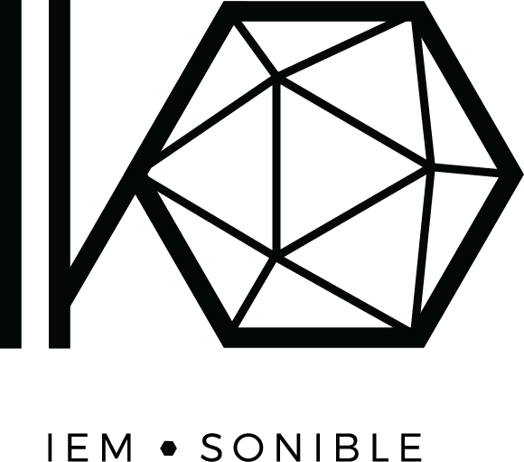
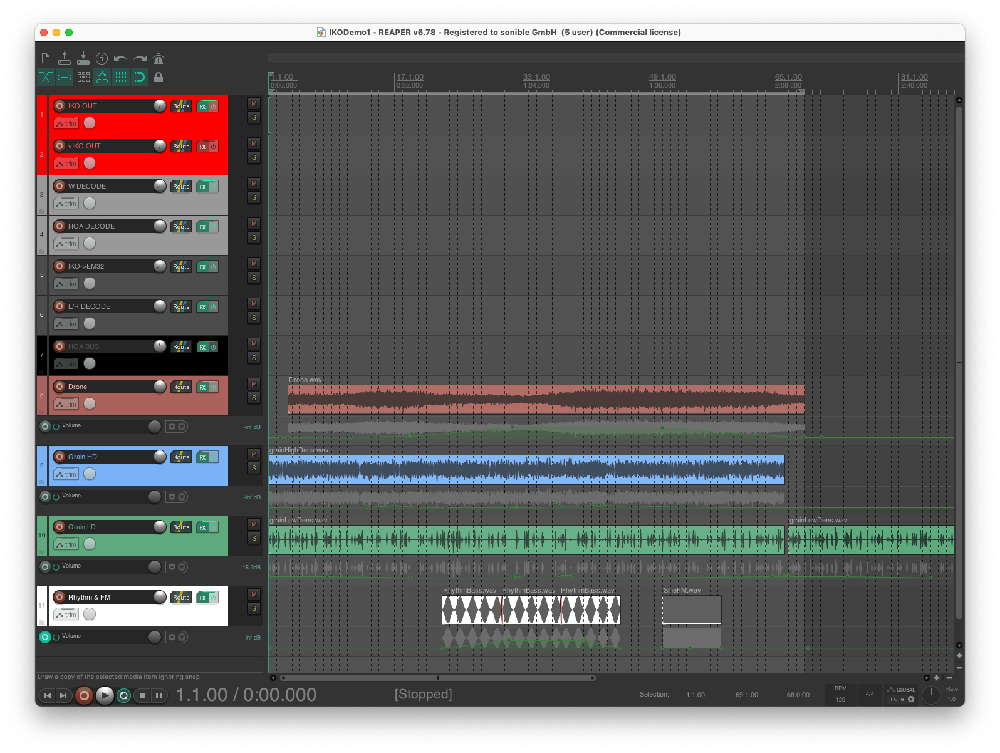
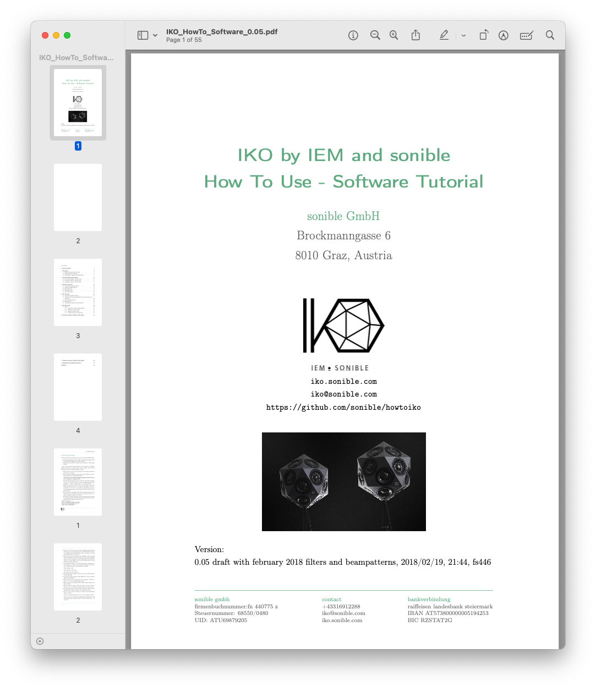
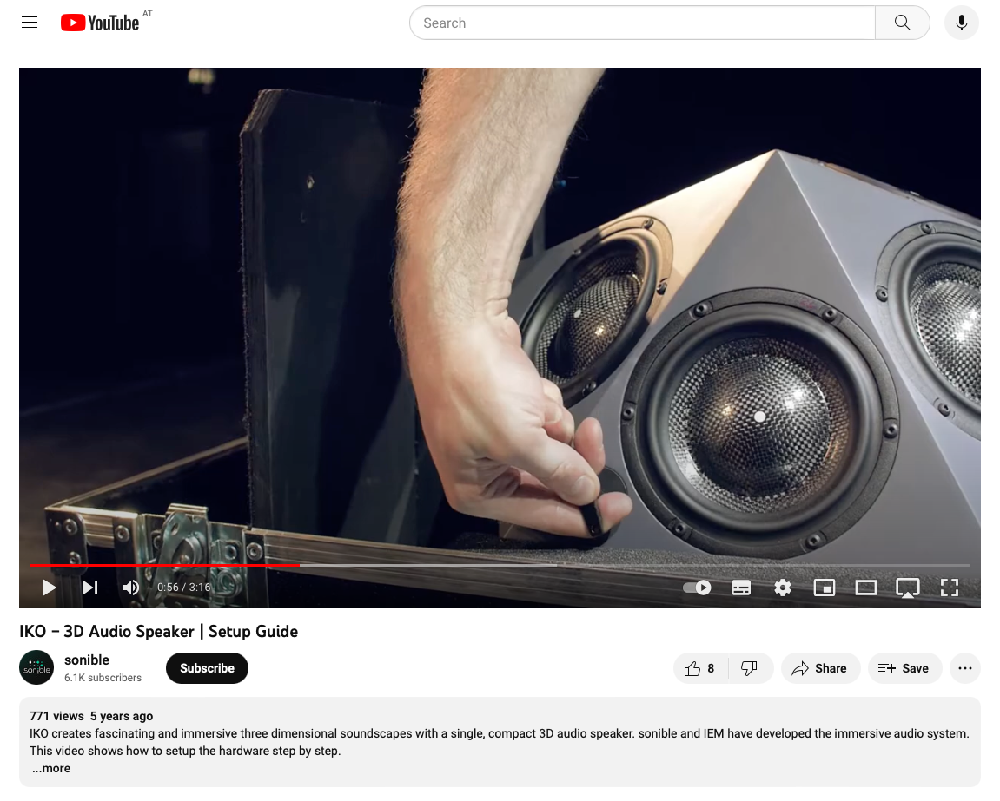

# How-To IKO

This repository will give you a brief overview of the history of the IKO project as well as and introduction in how to
set up your IKO system and what software components can be used.

It also contains different sets of [filter coefficients](IKOFilter) and [REAPER demo projects](/IKOReaperProjects).

## PDF Document

A very detailed documentation is available as PDF
download [here](IKOTutorials/IKOHowToSoftware/IKO_HowTo_Software_0.05.pdf).

## Tutorial Video

A quick hands-on video can be found on our [YouTube Channel](https://www.youtube.com/watch?v=c0RivAnQSxE&t=83s).

## Need Help?

If you need more help to get started with your IKO setup feel free to reach out
to [iko@sonible.com](mailto:iko@sonible.com).

